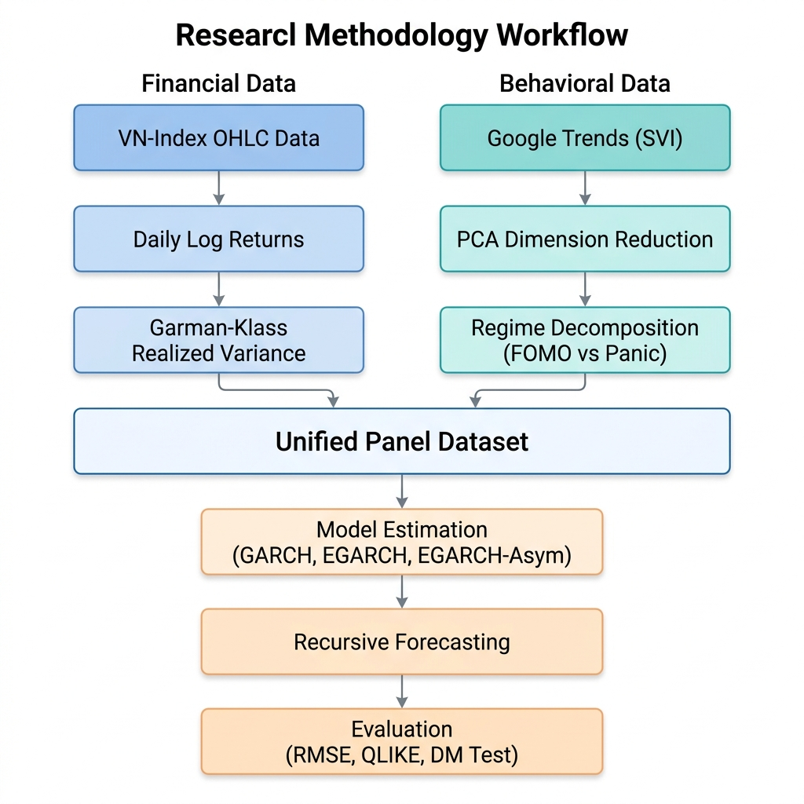

# Modeling and Forecasting VN-Index Volatility: An EGARCH-X Approach

[](https://www.python.org/)
[](https://github.com/astral-sh/uv)
[](https://opensource.org/licenses/MIT)

This repository contains the implementation of the research paper: **"Modeling and Forecasting Vietnamese Stock Market Volatility: An Asymmetric EGARCH-X Approach Using Google Trends"**.

## 📌 Project Overview

This study investigates whether the decomposition of retail investor attention (proxied by Google Search Volume Index - SVI) into regime-specific components (FOMO-driven vs. Panic-driven) provides incremental information for forecasting the conditional volatility of the VN-Index.

### Key Contributions:
1. **SVI PCA Latent Factor**: Address multicollinearity by extracting the common latent attention signal from multiple keywords.
2. **Behavioral Decomposition**: Separating attention into $SVI_{pos}$ (FOMO) and $SVI_{neg}$ (Panic).
3. **EGARCH-Asym Model**: Integrating asymmetric attention into an EGARCH framework with Student-t innovations.
4. **OOS Evaluation**: Rigorous evaluation against the Garman-Klass realized variance proxy.

## 🛠 Methodology

The following diagram illustrates the complete data processing and modeling pipeline:



## 🚀 Getting Started

### Prerequisites

- [uv](https://github.com/astral-sh/uv) (Modern Python package manager)
- Python 3.12+

### Installation

```bash
# Clone the repository
git clone https://github.com/Duongvu05/time_series.git
cd time_series

# Sync dependencies
uv sync
```

### Usage

The project is structured into modular scripts:

1. **Data Collection & Processing**:
   ```bash
   uv run python scripts/run_data.py
   ```
   *Fetches price data via `vnstock`, processes Google Trends SVI, and fits PCA.*

2. **Run Experiments**:
   ```bash
   uv run python scripts/run_experiments.py
   ```
   *Runs diagnostic tests, estimates GARCH/EGARCH models, and evaluates OOS forecasts.*

## 📊 Empirical Results (Preview)

| Model | RMSE | QLIKE | Rank |
| :- | :-: | :-: | :-: |
| **EGARCH-Asym (Proposed)** | **1.8912** | **0.3366** | **1** |
| Baseline EGARCH(1,1) | 2.0151 | 0.3473 | 2 |
| EGARCH-SVI (Aggregate) | 2.0291 | 0.3500 | 3 |
| Baseline GARCH(1,1) | 2.2702 | 0.3736 | 4 |

> [!NOTE]
> The **EGARCH-Asym** model achieves a 6.2% reduction in RMSE relative to the baseline EGARCH benchmark, proving the value of directional behavioral data.

## 📂 Project Structure

```text
├── configs/            # Configuration files
├── data/               # Processed datasets (CSV)
├── docs/               # Documentation and methodology assets
├── outputs/            # Experiment logs and LaTeX tables
├── paper/              # LaTeX source code for the final paper
├── scripts/            # Entry point scripts for data and experiments
└── src/time_series/    # Core library (models, config, utils)
```

## 📜 License

This project is licensed under the MIT License - see the [LICENSE](LICENSE) file for details.

## 👤 Author

- **Vu Ngoc Duong** - *National Economics University (NEU)*
- Student ID: 11230526
- Email: vungocduong255@gmail.com
